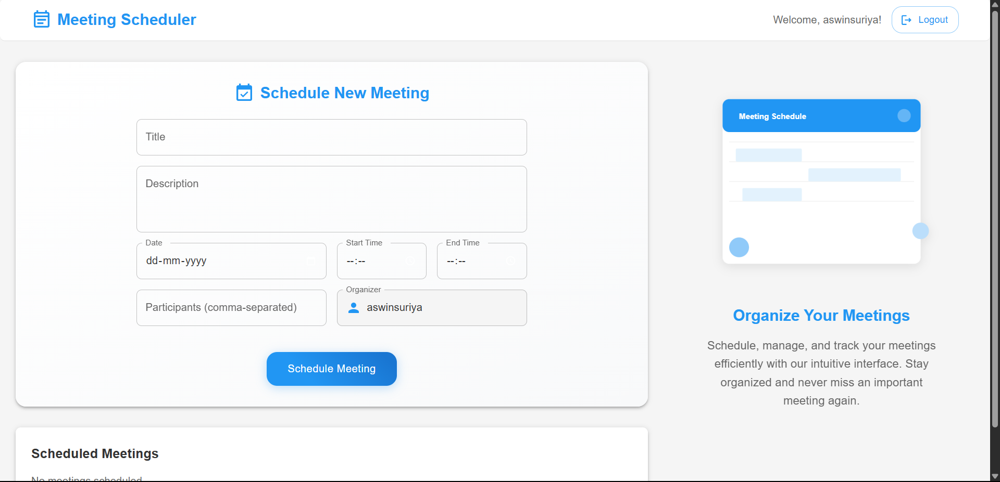

# Meeting Scheduler

A modern meeting scheduling application built with MERN stack.
## 📸 Demo




## Features

- Schedule new meetings with title, description, date, and time
- Add multiple participants to meetings
- View all scheduled meetings
- Delete meetings
- Responsive Material-UI design

## Setup Instructions

1. Install dependencies:
   ```bash
   npm install
   ```

2. Configure MongoDB:
   - Create a MongoDB Atlas account and database
   - Copy your connection string
   - Update the `backend/.env` file with your MongoDB connection string

3. Start the backend server:
   ```bash
   cd backend
   npm install
   node server.js
   ```

4. Start the frontend development server:
   ```bash
   npm run dev
   ```

5. Open your browser and navigate to `http://localhost:5173`

## Technologies Used

- Frontend:
  - Vite
  - React
  - Material-UI
  - Axios

- Backend:
  - Node.js
  - Express
  - MongoDB Atlas
  - Mongoose


